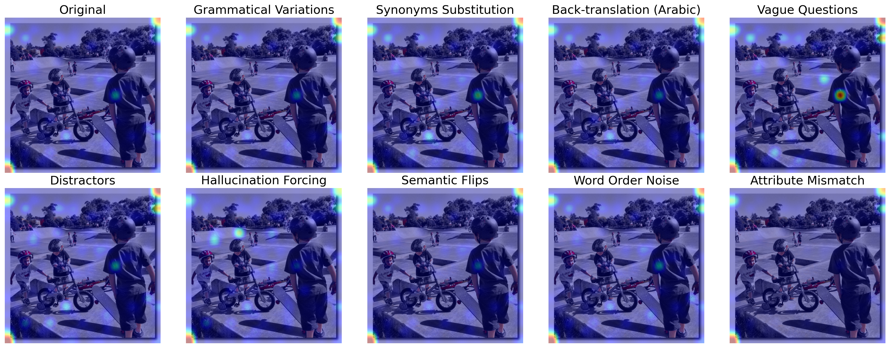
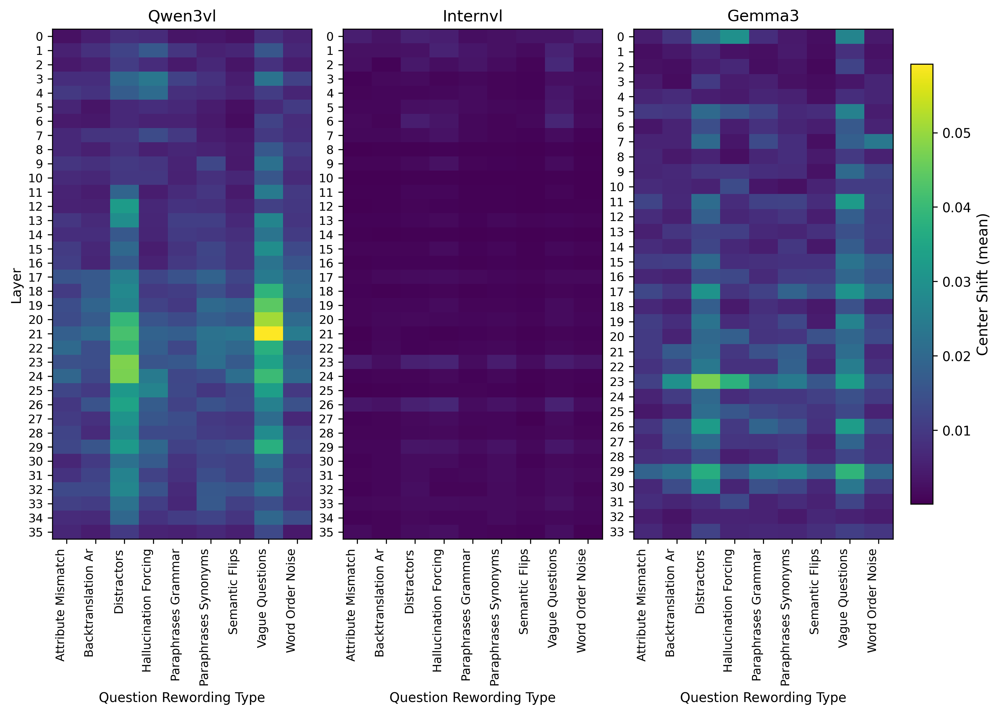

# VLM-RobustLens: Analyzing Visual Grounding Robustness of Vision–Language Models under Question Paraphrasing

This work investigates the robustness of Vision–Language Models (VLMs) against diverse types of question paraphrasing across multiple Visual Question Answering (VQA) datasets.
We focus on quantifying attention map drift to reveal how paraphrasing alters a model’s visual grounding and reasoning behavior. Through systematic analysis, we aim to identify which components of VLMs are most sensitive to linguistic variation and which types of paraphrases cause the largest performance and attention shifts. The findings offer actionable insights and design guidelines for developing future VLMs that maintain stable visual grounding and robust understanding under natural language rewordings.


## Setup Instructions

### 1. Create and Activate a Virtual Environment
It’s recommended to use a virtual environment to keep dependencies isolated.

```bash
# Create a virtual environment
python3 -m venv robolens

# Activate the environment
# On Linux/Mac:
source robolens/bin/activate

```
### 2. Install dependencies 
```bash
pip install -r requirements.txt

```
 or run

 ```bash
./setup.bash

```

## Datasets Preparation:
1. From the current parent directory, write the following commands to download the VQAv2 validation (VQA-Rephrasings dataset relies on it): 
```bash
mkdir Datasets
cd Datasets
wget http://images.cocodataset.org/zips/val2014.zip
unzip val2014.zip
```
2. The VQA-Rephrasings dataset can be found below:

https://facebookresearch.github.io/VQA-Rephrasings/

It should be saved under Datasets to have structure as follows:

- Datasets
  - compressed
    - v2_mscoco_valrep2014_humans_og_annotations.json
    - v2_OpenEnded_mscoco_valrep2014_humans_og_questions.json
   
3. From the Datasets directoy write the folling commands to download the VisualGenome Datset for images and QA pairs:
```bash
   mkdir -p VisualGenome/vg_100k
   cd VisualGenome

   wget https://homes.cs.washington.edu/~ranjay/visualgenome/data/dataset/question_answers.json.zip
   wget https://cs.stanford.edu/people/rak248/VG_100K_2/images.zip
   wget https://cs.stanford.edu/people/rak248/VG_100K_2/images2.zip
  
  
   unzip question_answers.json.zip -d VisualGenome
   unzip images.zip -d vg_100k
   unzip images2.zip -d vg_100k
  
  
   mv VG_100K/* vg_100k
   mv VG_100K_2/* vg_100k
  
  
   rmdir VG_100K
   rmdir VG_100K_2
   rm question_answers.json.zip images.zip images2.zip
```
4. This will download the images and merge them into a single folder vg_100k.
   
Visual Genome can be found here:

https://homes.cs.washington.edu/~ranjay/visualgenome/index.html

It should be saved under datasets and have the structure as follows:

- Datasets
 - VisualGenome
   - question_answers.json
   - vg_100k
     - A collection of 100k images.

5. To generate the rephrasings for visual genome run this from the parent directory

```bash
cd dataset

python VisualGenome.py --input_json "./Datasets/VisualGenome/question_answers.json" --output_json "desired/path/to/grammatical/rephrasings/output.json" --rephrase_tech "gram"

python VisualGenome.py --input_json "./Datasets/VisualGenome/question_answers.json" --output_json "desired/path/to/back/translation/output.json" --rephrase_tech "back"
```

The choices for --rephrase_tech are "gram" for Grammatical rephrasings done by the LLM, or "back" for the LLM to perfor back translation on questions.  Additionally, you can adjust the number of questions you want rephrased by specifying a number with the --max_questions param, otherwise the default is 600.

NOTE: For running just the rephrasings ensure that the import on line 9 in VisualGenome.py
is as follows:
```bash
from llm_rephrasing import back_translate, gram_var_and_syn_rep
```
The notation with "dataset." is only needed for the full inference pipeline. 

## Inference


1. To run the full pipeline on VQA-Rephrasings dataset (human paraphrased dataset):

```bash
python main.py --cache_dir <cashe directory that stores huggingface models> --model_name "internvl" --save_frequency 5
```
The choices for --model_name configuration: "internvl", "gemma3", "qwen3vl"

2. To run the full pipeline on Visual Genome Rephrasings dataset (LLM paraphrased dataset):
   
```bash
python main_genome.py \
--cache_dir <cashe directory that stores huggingface models> \
--model_name "gemma3" \
--json_path "/path/to/llm-rephrasings.json" \
--image_path "/path/to/VisualGenome/vg_100k/" \
--dataset "vg" \
--save_frequency 5 \
--attn_mode blocks
```

The input json_path should be the path to either your back translated rephrasings or grammatical rephrasings json. 

3. To run the stress analysis pipeline on VQA-Rephrasings or LLM-Rephrasings dataset:

```bash
python  main_stress_analysis.py --cache_dir <cashe directory that stores huggingface models> --model_name "qwen3vl" --save_frequency 5 --attn_mode blocks
```
The choices for --model_name configuration: "internvl", "gemma3", "qwen3vl" and if you want the model generates answers put to the command "--do_generate"

4. To evaluate the generated answers of the VLM models for the stress analysis on VQA-Rephrasings or LLM-Rephrasings:

```bash
python  evaluate_results_by_judge.py --cache_dir <cashe directory that stores huggingface models> --model_name "qwen3vl" --save_frequency 5
```
The choices for --model_name configuration: "internvl", "gemma3", "qwen3vl" 

## Results
<p align="center">
  
  <br>
  <sub><em>FText-to-Vision attention map visualization per each type of question rewording.</em></sub>
</p>
<p align="center">
  
  <br>
  <sub><em>Mean text-to-vision attention center shift across layers for different question rewordings for three models.</em></sub>
</p>


